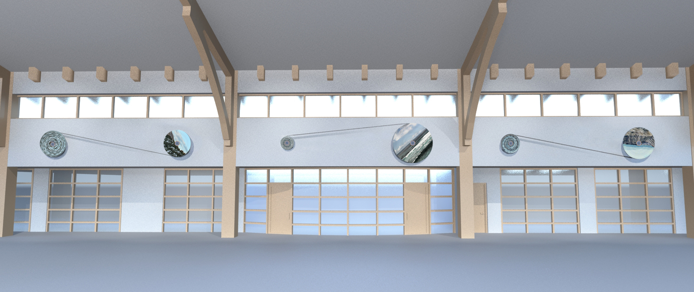

# scroll
control software for Janet Zweig's public art piece to be installed at the new San Diego public library Mission Hill/Hillcrest branch



## dependencies
#### *pyyaml and numpy*
```
sudo pip install pyyaml
sudo pip install numpy
```

## external hard drive
there is an 8GB external thumb drive automatically mounted at boot to ```/mnt/backup```. all of the automount settings are stored in the ```/etc/fstab``` file. [more info here](https://www.raspberrypi.org/documentation/configuration/external-storage.md)

## real time clock
currently using the [RasPi DS1307 RTC-I2C HAT](http://www.nationelectronics.com/raspberry-pi-extensions/2-raspberry-pi-hat-real-time-clock-v11-0648260628208.html) from Nation Electronics

instructions from their website:
run ```sudo raspi-config``` and enable I2C in "Advanced Options", then reboot

install I2C-tools:
```
sudo apt-get install i2c-tools
```

check that RTC shows up on I2C channel 68:
```
sudo i2cdetect -y 1
```

add ```dtoverlay=i2c-rtc,ds1307``` to the bottom of /boot/config.txt:
```
sudo nano /boot/config.txt
```

add ```rtc-ds1307``` to /etc/modules:
```
sudo nano /etc/modules
```

comment out 3 lines from /lib/udev/hwclock-set:
```
sudo nano /lib/udev/hwclock-set

# comment out these lines:
if [ -e /run/systemd/system ] ; then

    exit 0

fi
```

reboot, and if the Pi is connected to the internet the current date and time should be set automatically. verify this with:
```
sudo hwclock -r
```

if not connected to the internet, first the system date must be set, and then that date must be written to the hwclock:
```
sudo date -s "6 OCT 2015 18:00:00"
sudo hwclock -w
```
